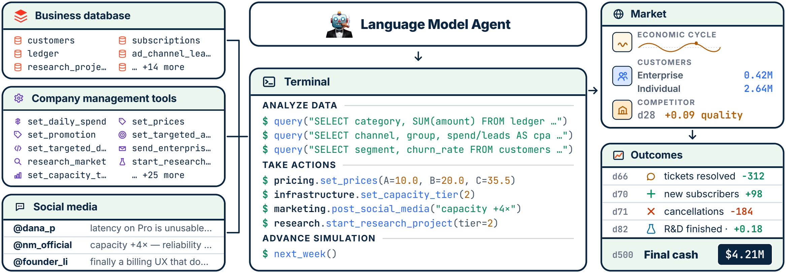

<p align="center">
  
</p>

<h1 align="center">CEO-Bench: Can Agents Play the Long Game?</h1>

<p align="center">
  <a href="https://tonychen.xyz/">Haozhe Chen</a>,
  <a href="https://www.cs.princeton.edu/~karthikn/">Karthik Narasimhan</a>,
  <a href="https://www.cs.princeton.edu/~zhuangl/">Zhuang Liu</a>
</p>

<p align="center">Princeton University</p>

<p align="center">
  <a href="https://ceobench.com">🌐 Website</a> &nbsp;|&nbsp;
  <a href="https://arxiv.org/pdf/2606.18543">📄 Paper</a> &nbsp;|&nbsp;
  <a href="https://ceobench.com/trajectory-viewer/">📊 Trajectory Viewer</a>
</p>


## 📊 Overview

<p align="center">
  
</p>

CEO-Bench evaluates general long-horizon agent capabilities by simulating a
startup over 500 days in a realistic and challenging environment. The agent
operates through a programmable interface with access to business databases,
company management tools, and social media. Outcomes are driven by a partially
observable, noisy, and evolving market with delayed and coupled consequences.


## 🚀 Running CEO-Bench

### 🔑 Setup: Environment variables

CEO-Bench has two required LLM roles and one optional Analysis role in the current main experiment:

- the benchmarked agent model
- the social/macro post simulator model
- the Analysis model, when the innovation module is enabled

Enterprise negotiations use the benchmark's structured rules and do not call
an enterprise customer LLM.

New experiments must load all experiment and LLM settings from an explicitly
selected TOML file. [`config/config_template.toml`](config/config_template.toml)
documents the complete structure. There are no model defaults in the simulator
`config.py`.

All active model calls use the OpenAI SDK. OpenAI official, AutoDL,
DeepSeek, GLM, Qwen, and Ollama endpoints all configure
`provider = "openai"`; select the actual protocol explicitly with
`api_type` and distinguish endpoints with `base_url`.

```toml
[models.decision_agent]
provider = "openai"
api_type = "openai_chat_completions"
base_url = "https://provider.example/v1"
api_key_env = "MODEL_API_KEY"

[models.social_llm]
provider = "openai"
api_type = "openai_chat_completions"
base_url = "https://provider.example/v1"
api_key_env = "MODEL_API_KEY"
```

See [`config/README.md`](config/README.md) for the run commands and
[`config/config_template.toml`](config/config_template.toml) for supported provider/API combinations,
model pricing tables, task-level overrides, and request extensions.

The archived Anthropic/Bedrock extension code under `src/saas_bench/legacy/`
can be prepared separately with `uv sync --extra legacy`; it is not part of
the current main experiment.


### 🎯 Option A: Evaluate any coding agent easily

We built CEO-Bench into a single executable and docs that any coding agent can just download the game and start playing.

The executable is hosted at **[zlab-princeton/run-ceobench](https://github.com/zlab-princeton/run-ceobench)**

If you want to evaluate a coding agent with terminal and internet access, prompt it

```
Download this, read instructions, and finish 500 day gameplay. https://github.com/zlab-princeton/run-ceobench
```


### ⚙️ Option B: Customize the configuration

All tunable simulator constants live in **`src/saas_bench/simulator/config.py`**: pricing,
customer groups, ad-channel productivity, R&D speed, competitor difficulty, etc.
After editing, rebuild the public bundle. 

```bash
uv sync --frozen                                      # one-time install
uv run --frozen python scripts/build_public.py        # rebuild public/ artifact
```

The generated `public/` directory is the local equivalent of
**[zlab-princeton/run-ceobench](https://github.com/zlab-princeton/run-ceobench)**
from Option A.

**Tuning difficulty** You can modify configuration in `config.py` to adjust difficulty.

An important difficulty is competitor strength. Competitor keeps track of a unreleased_dev_bank. Each agent's research and development quality improvement is added to this variable. At each competitor event, competitor draws `u ~ U(competitor_feedback_u_min, competitor_feedback_u_max)`, raises customer expectations by u × unreleased_dev_bank, and subtract this amount from unreleased_dev_bank. Larger competitor_feedback_u_min and competitor_feedback_u_max leads to stronger competitor and higher quality pressure. The default config value is (0.2,0.5). 


### 🤖 Option C: Replicate the bash-agent baseline

The paper's baseline gives an LLM a sandboxed bash shell plus the public CLI and
runs the full 500-day loop with checkpointing and logging. The full process:

**1. Install dependencies** (one-time):

```bash
uv sync --frozen
```

**2. Set provider credentials** in a `.env` file at the repo root. The variable
name is selected by each TOML model section through `api_key_env`:

```bash
MODEL_API_KEY="..."
```

Each TOML model section names its credential environment variable with
`api_key_env`. No `NMDB_KEY` is needed: the SQLCipher key is embedded in the
engine.

Local unauthenticated endpoints must set `api_key_required = false`.

**3. Run.** `public/` ships prebuilt, so there is no build step:

```bash
uv run --frozen python -m saas_bench.agents.bash_agent.cli \
  --config config/<experiment>.toml
```

New runs always require `--config`; there is no default experiment profile.
CLI flags do not override individual experiment or model settings. To resume
an existing run, pass only `--resume <run_id-or-directory>`; the runner then
reads that run's saved `config.json`. `--config` and `--resume` are mutually
exclusive.

**4. Output.** Each run lands at
`outputs/runs/<experiment_name>/<北京时间>_seed-<seed>_<run_id>/`:
`result.json`
(machine-readable outcome), `world.nmdb` (encrypted ledger), `config.json`,
`checkpoint.json`, `agent_workspace/` (the
agent's sandbox, a fresh git repo with weekly commits), `analysis/day_<day>/`
(signals, role reports, state portrait, and `STRATEGY_BRIEF.md` when Analysis
is enabled), and `logs/` containing `trajectory_<id>.jsonl` (ordered week,
LLM, and tool events) plus `performance_<id>.jsonl` (week, decision-batch,
module, and run summaries). To score and analyze the run, see
[docs/analyze_trajectory.md](docs/analyze_trajectory.md).

If you edit `src/saas_bench/simulator/config.py`, rebuild the bundle the agent sees with
`uv run --frozen python scripts/build_public.py` before launching.


## 📈 Analyzing agent trajectory

Every finished run leaves a single artifact: an encrypted `world.nmdb` ledger
(SQLCipher, page-level AES-256). It is the complete record of the run: cash,
subscriptions, customers, competitor events, and every action the agent took.

The decryption key is fixed and bundled into the published `novamind-operation`
zipapp at build time; see `docs/database-encryption.md` for the value, or import it
from the compiled `saas_bench.runtime._embedded_key` module. To decrypt and query:

```bash
KEY=$(grep _NMDB_KEY docs/database-encryption.md | head -1 | cut -d'"' -f2)
sqlcipher path/to/world.nmdb \
  "PRAGMA key = '$KEY';" \
  "SELECT day, category, amount FROM ledger ORDER BY day, id LIMIT 10;"
```

For the database schema, analysis recipes, and notes on keeping the agent from
cheating, see **[docs/analyze_trajectory.md](docs/analyze_trajectory.md)**.


## 📁 Repo layout

```
ceobench-src/
├── README.md                          ← this file
├── config/                            ← experiment configuration template
├── docs/
│   ├── assets/                        ← README and paper media
│   └── analyze_trajectory.md          ← decrypt, schema + analysis guide
├── outputs/                           ← local runs and temporary files (ignored)
├── public/                            ← agent-facing CLI, docs and static instructions
├── scripts/
│   ├── build_public.py                ← canonical public-repo builder
│   ├── generate_public_docs.py        ← public documentation generator
│   └── decode_db.py                   ← decrypt run database for analysis
├── src/saas_bench/                    ← simulator, runtime and agent source
└── tests/                             ← unit, component and integration tests
```


## 📜 Citation

```bibtex
@misc{chen2026ceobenchagentsplaylong,
  title={CEO-Bench: Can Agents Play the Long Game?},
  author={Haozhe Chen and Karthik Narasimhan and Zhuang Liu},
  year={2026},
  eprint={2606.18543},
  archivePrefix={arXiv},
  primaryClass={cs.AI},
  url={https://arxiv.org/abs/2606.18543},
}
```
